# Kubernetes Learning Notes

_A Journey from Fundamentals to Production-Ready Thinking_

---

## Table of Contents

- [Understanding Kubernetes](#understanding-kubernetes)
- [Cluster Architecture](#cluster-architecture)
- [Core Kubernetes Objects](#core-kubernetes-objects)
- [Local Development Tools](#local-development-tools)
- [Understanding Kubernetes Networking](#understanding-kubernetes-networking)
- [Production Architecture Patterns](#production-architecture-patterns)
- [CI/CD and GitOps](#cicd-and-gitops)
- [Organizational Models](#organizational-models)
- [Mental Models and Best Practices](#mental-models-and-best-practices)

---

# Understanding Kubernetes

Kubernetes (K8s) is a portable, extensible, open-source platform designed for managing containerized workloads and services. It facilitates both declarative configuration and automation, offering a robust ecosystem of services, support, and tools.

## The Problem Kubernetes Solves

When you run applications in containers, several challenges emerge:

1. **Container Lifecycle Management**: Containers crash, need updates, and require health monitoring
2. **Scaling**: Traffic patterns change, requiring dynamic scaling of container instances
3. **Service Discovery**: Containers get recreated with new IP addresses, making them hard to find
4. **Load Distribution**: Traffic needs intelligent distribution across multiple container instances
5. **Resource Management**: Efficient CPU and memory allocation across a cluster of machines

Kubernetes addresses these challenges through a **declarative approach**. Instead of telling Kubernetes _how_ to manage your containers step-by-step (imperative), you declare _what_ you want (desired state), and Kubernetes continuously works to make reality match your declaration.

## The Declarative Philosophy

The fundamental principle of Kubernetes is the **reconciliation loop**:

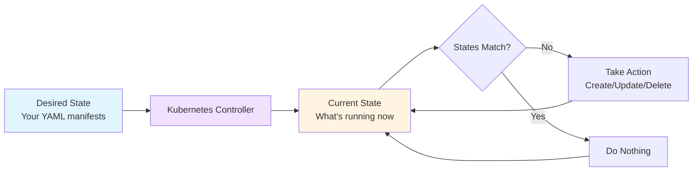
```mermaid
graph LR
    A[Desired State<br/>Your YAML manifests] --> B[Kubernetes Controller]
    B --> C[Current State<br/>What's running now]
    C --> D{States Match?}
    D -->|No| E[Take Action<br/>Create/Update/Delete]
    D -->|Yes| F[Do Nothing]
    E --> C
    F --> C
    style A fill:#e1f5ff
    style C fill:#fff4e1
    style B fill:#f0e1ff
```

This means Kubernetes is constantly monitoring your cluster and automatically correcting drift from your desired state. A container crashes? Kubernetes restarts it. Delete a Pod manually? Kubernetes recreates it if the Deployment specifies it should exist.

## What Kubernetes Provides

Kubernetes offers a comprehensive platform for:

- **Container Orchestration**: Running and managing containers across multiple machines
- **Automatic Scaling**: Horizontal and vertical scaling based on metrics
- **Self-Healing**: Automatic restart of failed containers and rescheduling from failed nodes
- **Service Discovery and Load Balancing**: Built-in DNS and traffic distribution
- **Automated Rollouts and Rollbacks**: Zero-downtime deployments with automatic failure recovery
- **Secret and Configuration Management**: Secure handling of sensitive data and application configuration
- **Storage Orchestration**: Automatic mounting of storage systems (local, cloud, network)

---

# Cluster Architecture

A Kubernetes cluster is composed of two main components: the **Control Plane** (the brain) and **Worker Nodes** (the workers). Understanding this architecture is crucial for troubleshooting and designing resilient systems.

## Architectural Overview

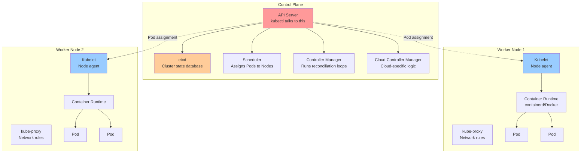
```mermaid
graph TB
    subgraph "Control Plane"
        API[API Server<br/>kubectl talks to this]
        ETCD[etcd<br/>Cluster state database]
        SCHED[Scheduler<br/>Assigns Pods to Nodes]
        CM[Controller Manager<br/>Runs reconciliation loops]
        CCM[Cloud Controller Manager<br/>Cloud-specific logic]
    end

    subgraph "Worker Node 1"
        KUBELET1[Kubelet<br/>Node agent]
        PROXY1[kube-proxy<br/>Network rules]
        RUNTIME1[Container Runtime<br/>containerd/Docker]
        POD1A[Pod]
        POD1B[Pod]
    end

    subgraph "Worker Node 2"
        KUBELET2[Kubelet<br/>Node agent]
        PROXY2[kube-proxy<br/>Network rules]
        RUNTIME2[Container Runtime]
        POD2A[Pod]
        POD2B[Pod]
    end

    API --> ETCD
    API --> SCHED
    API --> CM
    API --> CCM

    API -.->|Pod assignment| KUBELET1
    API -.->|Pod assignment| KUBELET2

    KUBELET1 --> RUNTIME1
    KUBELET2 --> RUNTIME2

    RUNTIME1 --> POD1A
    RUNTIME1 --> POD1B
    RUNTIME2 --> POD2A
    RUNTIME2 --> POD2B

    style API fill:#ff9999
    style ETCD fill:#ffcc99
    style KUBELET1 fill:#99ccff
    style KUBELET2 fill:#99ccff
```

## Control Plane Components

The control plane makes global decisions about the cluster and detects and responds to cluster events.

### API Server (`kube-apiserver`)

The API server is the **front door** to Kubernetes. Every operation—whether from `kubectl`, other control plane components, or applications—goes through the API server.

- Exposes the Kubernetes API (RESTful interface)
- Validates and processes API requests
- Is the only component that directly communicates with etcd
- Handles authentication and authorization
- Can be horizontally scaled for high availability

### etcd

etcd is a **consistent and highly-available key-value store** used as Kubernetes' backing store for all cluster data.

- Stores the entire cluster state (all objects, configurations, secrets)
- Provides strong consistency guarantees
- Supports watch operations (controllers can be notified of changes)
- **Critical component**: If etcd data is lost, the cluster state is lost
- Should be backed up regularly in production

### Scheduler (`kube-scheduler`)

The scheduler **watches for newly created Pods** that have no assigned node and selects a node for them to run on.

Selection factors include:

- Resource requirements (CPU, memory requests/limits)
- Hardware/software/policy constraints (node selectors, affinity/anti-affinity)
- Data locality (try to schedule near data)
- Inter-workload interference
- Deadlines and priorities

### Controller Manager (`kube-controller-manager`)

Runs multiple **controller processes** that watch the cluster state and make changes to move the current state toward the desired state.

Key controllers include:

- **Node Controller**: Monitors node health and responds to node failures
- **Replication Controller**: Maintains correct number of Pods for ReplicaSet objects
- **Endpoints Controller**: Populates Endpoints objects (joins Services & Pods)
- **Service Account & Token Controllers**: Create default accounts and API access tokens

### Cloud Controller Manager

Embeds **cloud-specific control logic**, allowing Kubernetes to interact with cloud provider APIs.

Cloud-specific controllers include:

- **Node Controller**: Checks with cloud provider to determine if a node has been deleted
- **Route Controller**: Sets up routes in cloud infrastructure
- **Service Controller**: Creates, updates, and deletes cloud load balancers

## Worker Node Components

Worker nodes are the machines that run your application workloads (Pods).

### Kubelet

The kubelet is an **agent that runs on each node** in the cluster, ensuring containers are running in Pods.

- Receives Pod specifications from the API server
- Ensures the containers described in those PodSpecs are running and healthy
- Reports node and Pod status back to the API server
- Manages container lifecycle (start, stop, restart)
- Executes liveness and readiness probes

### kube-proxy

kube-proxy is a **network proxy** that maintains network rules on nodes, allowing network communication to Pods.

- Implements the Kubernetes Service concept
- Manages iptables/IPVS rules for routing traffic
- Handles load balancing across Pod replicas
- Enables Service discovery through ClusterIP

### Container Runtime

The software responsible for **running containers**. Kubernetes supports several runtimes:

- **containerd** (most common, default in many distributions)
- **CRI-O** (lightweight, built specifically for Kubernetes)
- **Docker Engine** (via cri-dockerd, legacy support)

The runtime pulls container images, creates containers, and manages their execution.

## High Availability Considerations

Production clusters require **redundancy at every level**:

- **Multiple Control Plane Nodes**: Typically 3 or 5 for quorum-based decision making
- **Load Balanced API Server**: Distribute requests across API server instances
- **etcd Cluster**: 3 or 5 etcd instances with automatic failover
- **Multiple Worker Nodes**: Distribute workloads across nodes in different availability zones
- **Pod Disruption Budgets**: Ensure minimum number of Pods remain available during maintenance

---

# Core Kubernetes Objects

Kubernetes uses a collection of **objects** (also called resources) to represent the desired state of your cluster. These objects are persistent entities that define what workloads are running, how they're exposed, and what resources they can use.

## Pod

A **Pod** is the smallest deployable unit in Kubernetes. It represents a single instance of a running process in your cluster.

### Key Characteristics

- **One or More Containers**: Usually one, but can have multiple tightly-coupled containers (sidecar pattern)
- **Shared Resources**: Containers in a Pod share network namespace (IP address, port space) and can share storage volumes
- **Ephemeral**: Pods are mortal—they are born, they die, and they are not resurrected
- **Unique IP**: Each Pod gets its own IP address in the cluster network

### When to Use Multiple Containers in a Pod

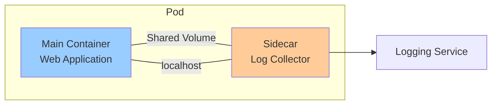
```mermaid
graph LR
    subgraph "Pod"
        A[Main Container<br/>Web Application] ---|Shared Volume| B[Sidecar<br/>Log Collector]
        A ---|localhost| B
    end
    B --> C[Logging Service]
    style A fill:#99ccff
    style B fill:#ffcc99
```

Common multi-container patterns:

- **Sidecar**: Helper container (logging, monitoring, proxying)
- **Adapter**: Standardize output from main container
- **Ambassador**: Proxy connections to external services

### Pod Lifecycle

Pods go through several phases:

1. **Pending**: Pod accepted but container(s) not yet created
2. **Running**: Pod bound to node, containers created, at least one running
3. **Succeeded**: All containers terminated successfully
4. **Failed**: All containers terminated, at least one failed
5. **Unknown**: Pod state cannot be determined

You rarely create Pods directly—instead, you use higher-level controllers like Deployments.

## Deployment

A **Deployment** provides declarative updates for Pods and ReplicaSets. It's the most common way to run applications in Kubernetes.

### What Deployments Manage

When you create a Deployment, you specify:

- **Container image** to run
- **Number of replicas** (Pod copies) to maintain
- **Update strategy** for rolling out changes
- **Resource limits** (CPU, memory)

```yaml
apiVersion: apps/v1
kind: Deployment
metadata:
  name: nginx-deployment
spec:
  replicas: 3 # Kubernetes maintains exactly 3 Pods
  selector:
    matchLabels:
      app: nginx
  template:
    metadata:
      labels:
        app: nginx
    spec:
      containers:
        - name: nginx
          image: nginx:1.21
          ports:
            - containerPort: 80
          resources:
            requests:
              cpu: 100m
              memory: 128Mi
            limits:
              cpu: 200m
              memory: 256Mi
```

### The Deployment Hierarchy

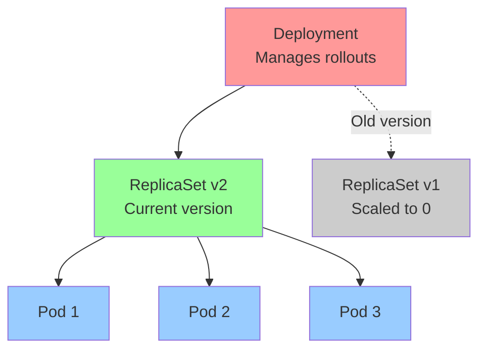
```mermaid
graph TD
    A[Deployment<br/>Manages rollouts] --> B[ReplicaSet v2<br/>Current version]
    A -.->|Old version| C[ReplicaSet v1<br/>Scaled to 0]
    B --> D[Pod 1]
    B --> E[Pod 2]
    B --> F[Pod 3]

    style A fill:#ff9999
    style B fill:#99ff99
    style C fill:#cccccc
    style D fill:#99ccff
    style E fill:#99ccff
    style F fill:#99ccff
```

**Deployment** → creates and manages **ReplicaSets** → creates and manages **Pods**

### Self-Healing in Action

When a Pod fails or is deleted, the Deployment controller notices the current state (2 Pods) doesn't match desired state (3 Pods), and automatically creates a replacement:

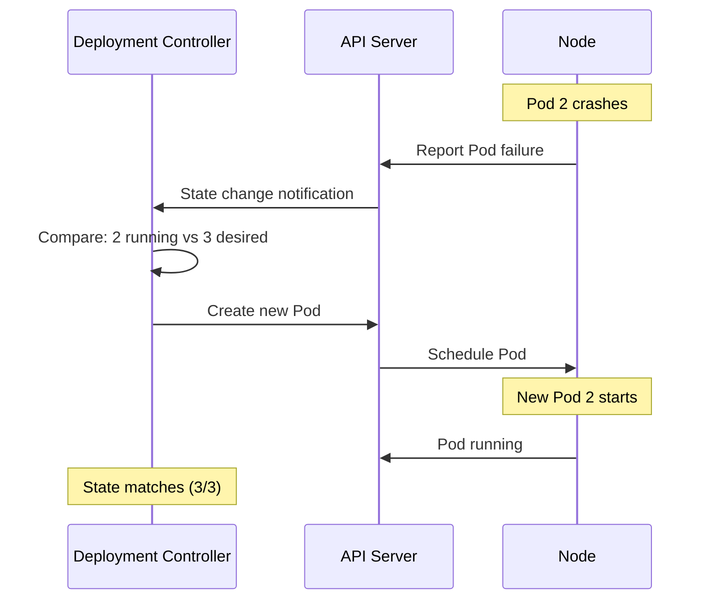
```mermaid
sequenceDiagram
    participant D as Deployment Controller
    participant API as API Server
    participant N as Node

    Note over N: Pod 2 crashes
    N->>API: Report Pod failure
    API->>D: State change notification
    D->>D: Compare: 2 running vs 3 desired
    D->>API: Create new Pod
    API->>N: Schedule Pod
    Note over N: New Pod 2 starts
    N->>API: Pod running
    Note over D: State matches (3/3)
```

### Rolling Updates

Deployments enable **zero-downtime updates** through rolling updates:

```yaml
strategy:
  type: RollingUpdate
  rollingUpdate:
    maxUnavailable: 1 # Max Pods that can be unavailable during update
    maxSurge: 1 # Max extra Pods during update
```

Update process:

1. Create new Pod with updated image
2. Wait for it to become ready
3. Terminate one old Pod
4. Repeat until all Pods updated

If the update fails (e.g., new image crashes), you can rollback:

```bash
kubectl rollout undo deployment/nginx-deployment
```

## ReplicaSet

A **ReplicaSet** ensures a specified number of identical Pod replicas are running at any given time. You typically don't create ReplicaSets directly—Deployments manage them for you.

### Why ReplicaSets Exist

- **High Availability**: If one Pod dies, others continue serving traffic
- **Load Distribution**: Multiple Pods can handle more requests
- **Rolling Updates**: Deployments use multiple ReplicaSets to enable gradual rollouts

## Service

A **Service** is a stable network abstraction that provides a consistent way to access a set of Pods. It solves a critical problem: Pod IPs are ephemeral and change frequently.

### The Problem Services Solve

Without Services:

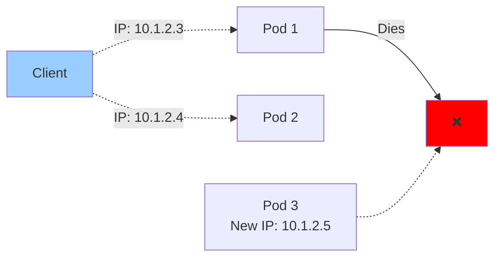
```mermaid
graph LR
    A[Client] -.->|IP: 10.1.2.3| P1[Pod 1]
    A -.->|IP: 10.1.2.4| P2[Pod 2]
    P1 -->|Dies| X1[❌]
    P3[Pod 3<br/>New IP: 10.1.2.5] -.-> X1

    style X1 fill:#ff0000
    style A fill:#99ccff
```

_Client loses connection! Must discover new IP_

With Services:

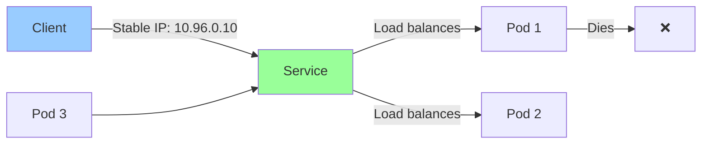
```mermaid
graph LR
    A[Client] -->|Stable IP: 10.96.0.10| S[Service]
    S -->|Load balances| P1[Pod 1]
    S -->|Load balances| P2[Pod 2]
    P1 -->|Dies| X1[❌]
    P3[Pod 3] --> S

    style S fill:#99ff99
    style A fill:#99ccff
```

_Service automatically updates endpoints_

### Service Types

#### ClusterIP (Default)

Exposes the Service on an **internal cluster IP**. Only reachable from within the cluster.

```yaml
apiVersion: v1
kind: Service
metadata:
  name: backend-service
spec:
  type: ClusterIP
  selector:
    app: backend # Targets Pods with this label
  ports:
    - port: 80 # Service port
      targetPort: 8080 # Container port
```

**Use case**: Internal microservices communication

#### NodePort

Exposes the Service on each Node's IP at a **static port**. Accessible from outside the cluster via `<NodeIP>:<NodePort>`.

```yaml
apiVersion: v1
kind: Service
metadata:
  name: frontend-service
spec:
  type: NodePort
  selector:
    app: frontend
  ports:
    - port: 80
      targetPort: 8080
      nodePort: 30080 # Port on each node (30000-32767)
```

**Use case**: Development/testing, small deployments

#### LoadBalancer

Creates an **external load balancer** (in supported cloud environments) and assigns a public IP.

```yaml
apiVersion: v1
kind: Service
metadata:
  name: web-service
spec:
  type: LoadBalancer
  selector:
    app: web
  ports:
    - port: 80
      targetPort: 8080
```

**Use case**: Production applications needing external access

#### ExternalName

Maps a Service to a **DNS name**, useful for accessing external services.

```yaml
apiVersion: v1
kind: Service
metadata:
  name: external-db
spec:
  type: ExternalName
  externalName: database.example.com
```

### Traffic Flow with Services

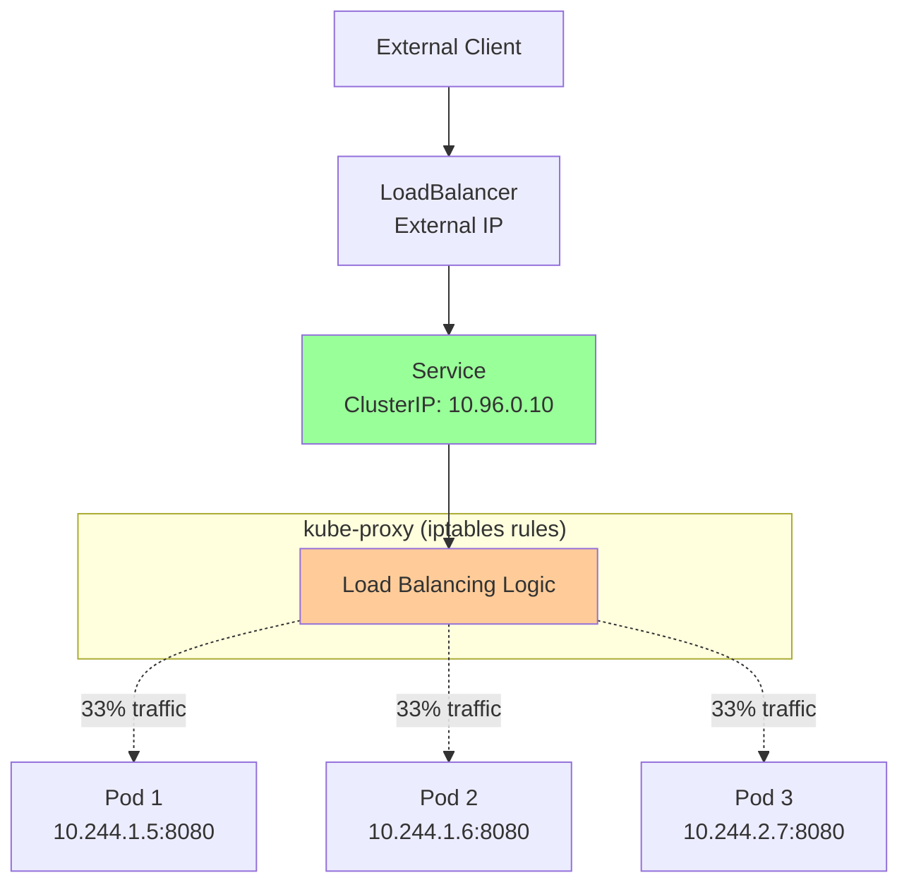
```mermaid
graph TB
    Client[External Client]
    LB[LoadBalancer<br/>External IP]
    Service[Service<br/>ClusterIP: 10.96.0.10]

    subgraph "kube-proxy (iptables rules)"
        KP[Load Balancing Logic]
    end

    Pod1[Pod 1<br/>10.244.1.5:8080]
    Pod2[Pod 2<br/>10.244.1.6:8080]
    Pod3[Pod 3<br/>10.244.2.7:8080]

    Client --> LB
    LB --> Service
    Service --> KP
    KP -.->|33% traffic| Pod1
    KP -.->|33% traffic| Pod2
    KP -.->|33% traffic| Pod3

    style Service fill:#99ff99
    style KP fill:#ffcc99
```

### Service Discovery

Kubernetes provides two main methods for service discovery:

1. **Environment Variables**: Automatically injected into Pods

   ```
   BACKEND_SERVICE_HOST=10.96.0.10
   BACKEND_SERVICE_PORT=80
   ```

2. **DNS** (preferred): Kubernetes runs an internal DNS server (CoreDNS)
   ```
   backend-service.default.svc.cluster.local
   ```

From any Pod, you can connect to a Service using just its name:

```bash
curl http://backend-service
```

## ConfigMap and Secret

**ConfigMaps** store non-sensitive configuration data, while **Secrets** store sensitive data (credentials, tokens, keys).

### ConfigMap Example

```yaml
apiVersion: v1
kind: ConfigMap
metadata:
  name: app-config
data:
  database_url: "postgres://db.example.com:5432/mydb"
  log_level: "info"
  feature_flags.json: |
    {
      "new_ui": true,
      "beta_features": false
    }
```

Using in a Pod:

```yaml
spec:
  containers:
    - name: app
      image: myapp:1.0
      env:
        - name: DATABASE_URL
          valueFrom:
            configMapKeyRef:
              name: app-config
              key: database_url
      volumeMounts:
        - name: config
          mountPath: /etc/config
  volumes:
    - name: config
      configMap:
        name: app-config
```

### Secret Example

```yaml
apiVersion: v1
kind: Secret
metadata:
  name: db-credentials
type: Opaque
data:
  username: YWRtaW4= # base64 encoded
  password: cGFzc3dvcmQxMjM=
```

**Important**: Secrets are only base64-encoded, not encrypted at rest by default. Enable encryption at rest in production clusters.

## Namespace

**Namespaces** provide a mechanism for isolating groups of resources within a single cluster. Think of them as virtual clusters within your physical cluster.

### Default Namespaces

- **default**: Resources with no namespace specified
- **kube-system**: System components (kube-dns, metrics-server)
- **kube-public**: Publicly readable, mostly for cluster information
- **kube-node-lease**: Node heartbeat data for improved performance

### Use Cases

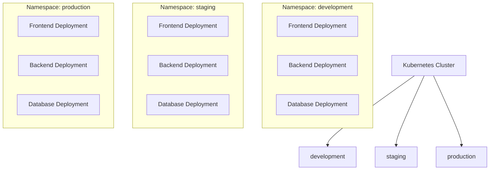
```mermaid
graph TB
    Cluster[Kubernetes Cluster]

    subgraph "Namespace: development"
        D1[Frontend Deployment]
        D2[Backend Deployment]
        D3[Database Deployment]
    end

    subgraph "Namespace: staging"
        S1[Frontend Deployment]
        S2[Backend Deployment]
        S3[Database Deployment]
    end

    subgraph "Namespace: production"
        P1[Frontend Deployment]
        P2[Backend Deployment]
        P3[Database Deployment]
    end

    Cluster --> development
    Cluster --> staging
    Cluster --> production
```

Benefits:

- **Resource Isolation**: Separate dev, staging, production
- **Access Control**: RBAC policies per namespace
- **Resource Quotas**: Limit CPU/memory per namespace
- **Name Scoping**: Same resource names in different namespaces

---

# Local Development Tools

Running Kubernetes locally is essential for learning and development. Several tools enable you to run a Kubernetes cluster on your laptop.

## kubectl: The Kubernetes CLI

`kubectl` is the **command-line interface** for interacting with any Kubernetes cluster—whether it's running locally, in staging, or in production.

### How kubectl Works

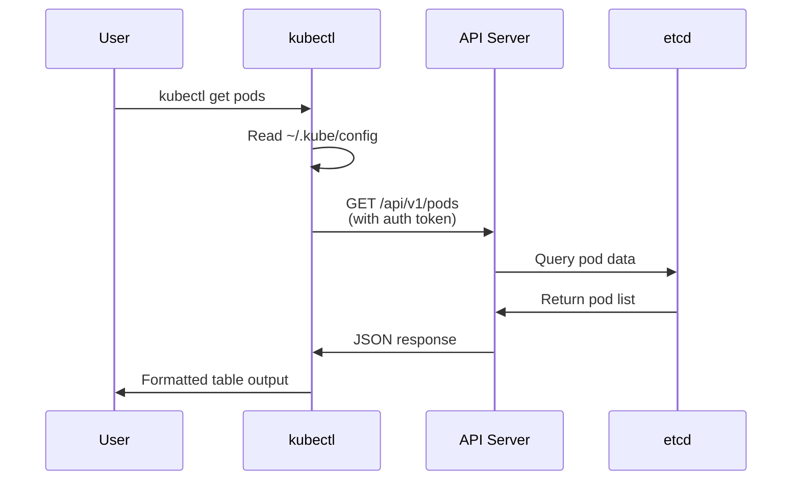
```mermaid
sequenceDiagram
    participant U as User
    participant K as kubectl
    participant A as API Server
    participant E as etcd

    U->>K: kubectl get pods
    K->>K: Read ~/.kube/config
    K->>A: GET /api/v1/pods<br/>(with auth token)
    A->>E: Query pod data
    E->>A: Return pod list
    A->>K: JSON response
    K->>U: Formatted table output
```

### Configuration Context

kubectl uses a **kubeconfig file** (default: `~/.kube/config`) that contains:

- **Clusters**: API server URLs and certificates
- **Users**: Authentication credentials
- **Contexts**: Combination of cluster + user + namespace

```bash
# View current context
kubectl config current-context

# List all contexts
kubectl config get-contexts

# Switch context
kubectl config use-context minikube

# Set default namespace for context
kubectl config set-context --current --namespace=dev
```

### Essential Commands

#### Viewing Resources

```bash
# List pods in current namespace
kubectl get pods

# List all pods in all namespaces
kubectl get pods --all-namespaces
kubectl get pods -A

# Watch pods for changes
kubectl get pods --watch

# Get more details
kubectl get pods -o wide

# Get YAML/JSON output
kubectl get pod my-pod -o yaml
kubectl get pod my-pod -o json
```

#### Describing Resources

```bash
# Detailed info including events
kubectl describe pod my-pod
kubectl describe service my-service
kubectl describe node worker-1
```

#### Logs and Debugging

```bash
# View container logs
kubectl logs my-pod

# Stream logs live
kubectl logs -f my-pod

# Logs from previous container instance (if crashed)
kubectl logs my-pod --previous

# Logs from specific container in multi-container pod
kubectl logs my-pod -c sidecar-container

# Execute commands in a running container
kubectl exec my-pod -- ls /app
kubectl exec -it my-pod -- /bin/bash

# Port forward to a pod
kubectl port-forward pod/my-pod 8080:80

# Port forward to a service
kubectl port-forward service/my-service 8080:80
```

#### Creating and Updating Resources

```bash
# Create from file
kubectl apply -f deployment.yaml

# Create from directory
kubectl apply -f ./manifests/

# Create from URL
kubectl apply -f https://example.com/manifest.yaml

# Delete resources
kubectl delete -f deployment.yaml
kubectl delete pod my-pod
kubectl delete deployment my-deployment
```

#### Scaling and Rolling Updates

```bash
# Scale deployment
kubectl scale deployment my-app --replicas=5

# Update image (triggers rolling update)
kubectl set image deployment/my-app app=myapp:v2

# Check rollout status
kubectl rollout status deployment/my-app

# View rollout history
kubectl rollout history deployment/my-app

# Rollback to previous version
kubectl rollout undo deployment/my-app

# Rollback to specific revision
kubectl rollout undo deployment/my-app --to-revision=2

# Restart all pods in deployment
kubectl rollout restart deployment/my-app
```

#### Resource Management

```bash
# Get resource usage
kubectl top nodes
kubectl top pods

# Edit resource directly (opens in editor)
kubectl edit deployment my-app

# View cluster info
kubectl cluster-info

# View API resources
kubectl api-resources

# Explain resource fields
kubectl explain pod
kubectl explain pod.spec.containers
```

## Minikube: Single-Node Cluster

**Minikube** creates a local single-node Kubernetes cluster, perfect for learning and testing.

### Architecture

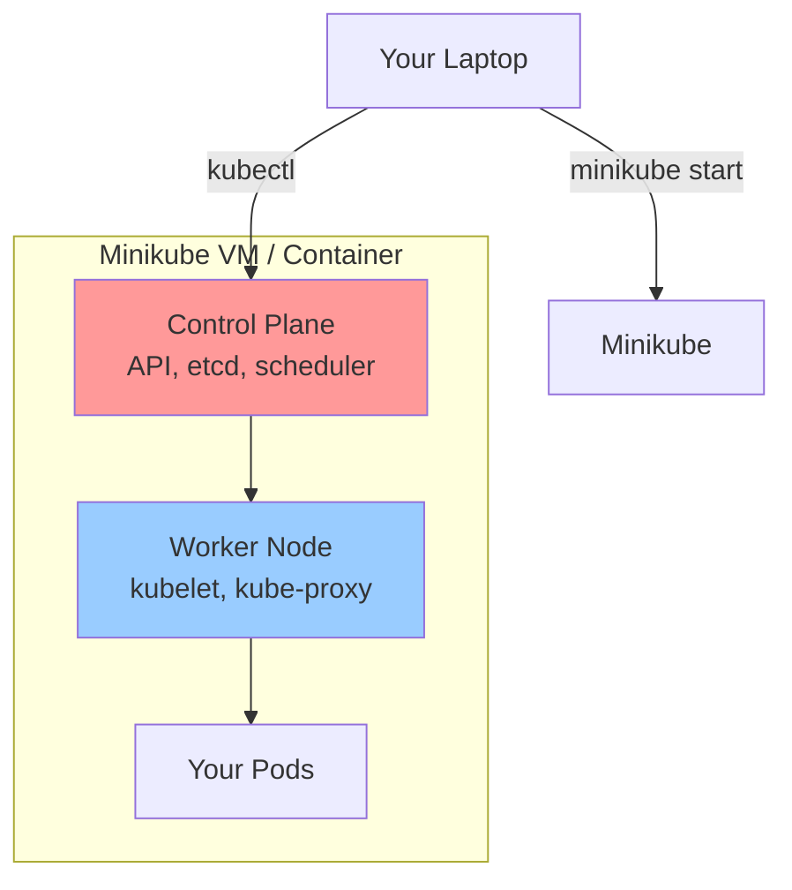
```mermaid
graph TB
    Host[Your Laptop]

    subgraph "Minikube VM / Container"
        CP[Control Plane<br/>API, etcd, scheduler]
        Node[Worker Node<br/>kubelet, kube-proxy]
        Pods[Your Pods]
    end

    Host -->|minikube start| Minikube
    Host -->|kubectl| CP
    CP --> Node
    Node --> Pods

    style CP fill:#ff9999
    style Node fill:#99ccff
```

### Common Commands

```bash
# Start cluster
minikube start

# Start with specific Kubernetes version
minikube start --kubernetes-version=v1.27.0

# Start with more resources
minikube start --cpus=4 --memory=8192

# Stop cluster (preserves state)
minikube stop

# Delete cluster
minikube delete

# Access cluster
kubectl get nodes

# Open Kubernetes dashboard
minikube dashboard

# Get service URL (creates tunnel)
minikube service my-service

# SSH into the node
minikube ssh

# Load local Docker image into minikube
minikube image load myapp:latest
```

### Minikube Addons

Minikube includes helpful addons:

```bash
# List available addons
minikube addons list

# Enable ingress controller
minikube addons enable ingress

# Enable metrics server (for kubectl top)
minikube addons enable metrics-server

# Enable registry
minikube addons enable registry
```

### When to Use Minikube

✅ **Good for:**

- Learning Kubernetes
- Quick local testing
- Running tutorials
- Development on a single machine

❌ **Limitations:**

- Single-node only (can't test multi-node scenarios)
- Not suitable for testing production-like setups
- Performance limited by local resources
- Networking differs from real clusters

## kind: Kubernetes IN Docker

**kind** runs Kubernetes clusters using Docker containers as nodes. It's faster and more flexible than Minikube for certain use cases.

### Architecture

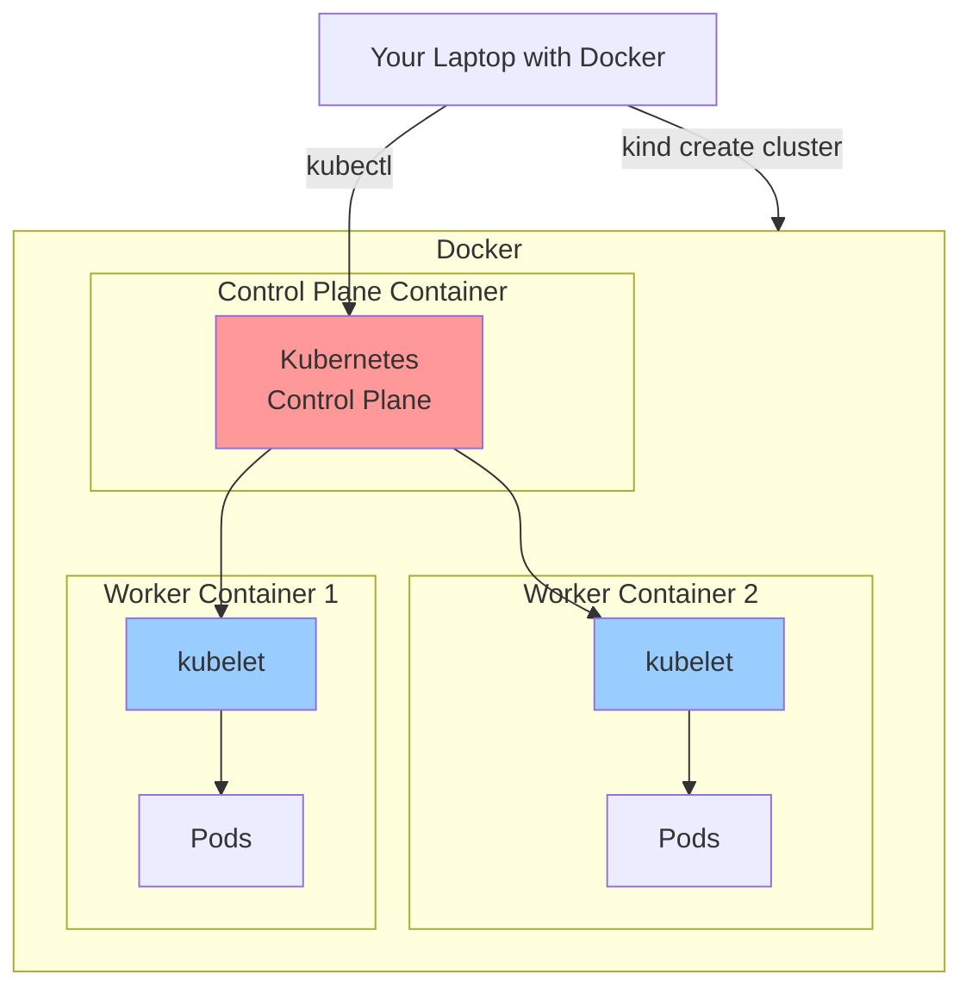
```mermaid
graph TB
    Host[Your Laptop with Docker]

    subgraph "Docker"
        subgraph "Control Plane Container"
            CP[Kubernetes<br/>Control Plane]
        end

        subgraph "Worker Container 1"
            W1[kubelet]
            P1[Pods]
        end

        subgraph "Worker Container 2"
            W2[kubelet]
            P2[Pods]
        end
    end

    Host -->|kind create cluster| Docker
    Host -->|kubectl| CP
    CP --> W1
    CP --> W2
    W1 --> P1
    W2 --> P2

    style CP fill:#ff9999
    style W1 fill:#99ccff
    style W2 fill:#99ccff
```

### Configuration

Create a multi-node cluster:

```yaml
# kind-config.yaml
kind: Cluster
apiVersion: kind.x-k8s.io/v1alpha4
nodes:
  - role: control-plane
    extraPortMappings:
      - containerPort: 80
        hostPort: 80
        protocol: TCP
  - role: worker
  - role: worker
```

```bash
# Create cluster with config
kind create cluster --config kind-config.yaml

# Create cluster with name
kind create cluster --name my-cluster

# List clusters
kind get clusters

# Delete cluster
kind delete cluster --name my-cluster

# Load local image
kind load docker-image myapp:latest --name my-cluster
```

### When to Use kind

✅ **Good for:**

- CI/CD pipelines (fast startup)
- Testing multi-node configurations
- Testing Kubernetes upgrades
- Development with multiple clusters
- Validating Kubernetes manifests

❌ **Limitations:**

- Requires Docker
- Networking can be tricky (need port mappings)
- Not a full environment (no cloud integrations)

## kubeadm: Production Cluster Bootstrap

**kubeadm** is a tool for bootstrapping production-grade Kubernetes clusters. It handles the complexity of setting up control plane components.

### Use Cases

- Creating production clusters on bare metal or VMs
- Building custom Kubernetes distributions
- Learning cluster internals deeply

### Basic Workflow

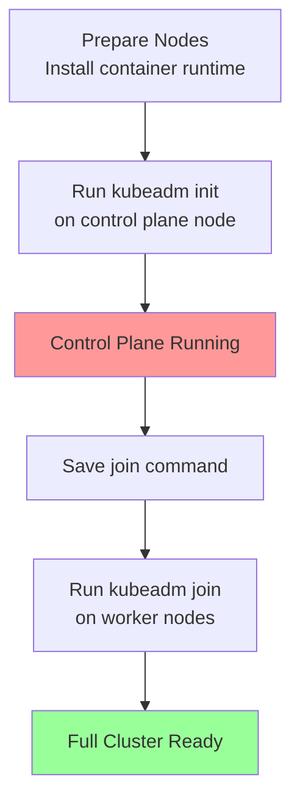
```mermaid
graph TD
    A[Prepare Nodes<br/>Install container runtime] --> B[Run kubeadm init<br/>on control plane node]
    B --> C[Control Plane Running]
    C --> D[Save join command]
    D --> E[Run kubeadm join<br/>on worker nodes]
    E --> F[Full Cluster Ready]

    style C fill:#ff9999
    style F fill:#99ff99
```

### When to Use kubeadm

✅ **Good for:**

- Production on-premise clusters
- Custom cluster configurations
- Learning cluster bootstrapping
- Cluster automation (with tools like Kubespray, Rancher)

❌ **Complexity:**

- Manual infrastructure management
- Need to manage control plane HA
- Network plugin configuration
- Certificate management

Most organizations use **managed Kubernetes** (EKS, GKE, AKS) instead of kubeadm for production.

## Comparison Matrix

| Feature               | Minikube | kind       | kubeadm    |
| --------------------- | -------- | ---------- | ---------- |
| **Nodes**             | Single   | Multiple   | Multiple   |
| **Speed**             | Slower   | Fast       | Varies     |
| **Use Case**          | Learning | CI/Testing | Production |
| **Setup**             | Simple   | Simple     | Complex    |
| **Persistence**       | Yes      | No         | Yes        |
| **Cloud Integration** | Limited  | No         | Yes        |
| **Production Ready**  | ❌       | ❌         | ✅         |

---

# Understanding Kubernetes Networking

Networking is one of the most complex aspects of Kubernetes. Understanding how traffic flows is crucial for debugging and designing applications.

## The Kubernetes Network Model

Kubernetes networking is built on several fundamental requirements:

1. **All Pods can communicate** with each other without NAT
2. **All Nodes can communicate** with all Pods without NAT
3. **Pod sees its own IP** as the same IP that others see it as

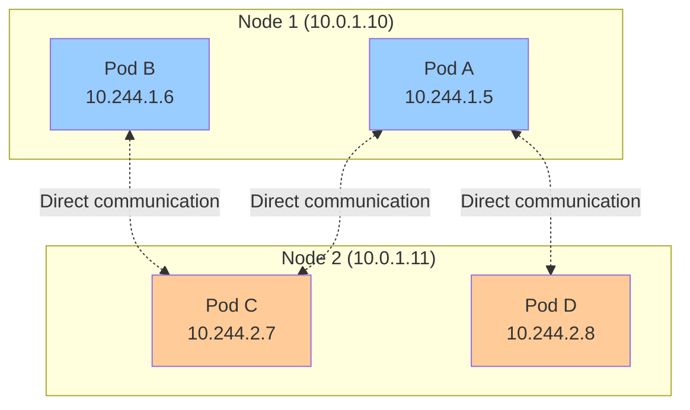
```mermaid
graph TB
    subgraph "Node 1 (10.0.1.10)"
        Pod1[Pod A<br/>10.244.1.5]
        Pod2[Pod B<br/>10.244.1.6]
    end

    subgraph "Node 2 (10.0.1.11)"
        Pod3[Pod C<br/>10.244.2.7]
        Pod4[Pod D<br/>10.244.2.8]
    end

    Pod1 <-.->|Direct communication| Pod3
    Pod1 <-.->|Direct communication| Pod4
    Pod2 <-.->|Direct communication| Pod3

    style Pod1 fill:#99ccff
    style Pod2 fill:#99ccff
    style Pod3 fill:#ffcc99
    style Pod4 fill:#ffcc99
```

This is achieved through a **Container Network Interface (CNI) plugin** (Calico, Flannel, Weave, Cilium).

## Service Networking Deep Dive

Services provide stable networking for ephemeral Pods. Let's understand how this works.

### Service IP Allocation

When you create a Service, Kubernetes assigns it an IP from the **service CIDR range** (e.g., `10.96.0.0/12`). This IP doesn't exist on any interface—it's virtual.

### How kube-proxy Implements Services

kube-proxy runs on every node and watches for Service and Endpoint changes. It configures the node to route Service traffic to Pods.

#### iptables Mode (Most Common)

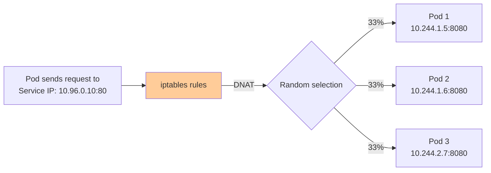
```mermaid
graph LR
    A[Pod sends request to<br/>Service IP: 10.96.0.10:80] --> B[iptables rules]
    B -->|DNAT| C{Random selection}
    C -->|33%| D[Pod 1<br/>10.244.1.5:8080]
    C -->|33%| E[Pod 2<br/>10.244.1.6:8080]
    C -->|33%| F[Pod 3<br/>10.244.2.7:8080]

    style B fill:#ffcc99
```

kube-proxy creates iptables rules that:

1. Intercept packets destined for Service IP
2. Perform Destination NAT (DNAT) to a random Pod IP
3. Track connection state for return traffic

#### IPVS Mode (High Performance)

Uses Linux IPVS (IP Virtual Server) for better performance at scale:

- Better load balancing algorithms
- Lower latency
- Handles more services/endpoints

### Load Balancing Behavior

**Important**: Service load balancing is **session-based**, not request-based.

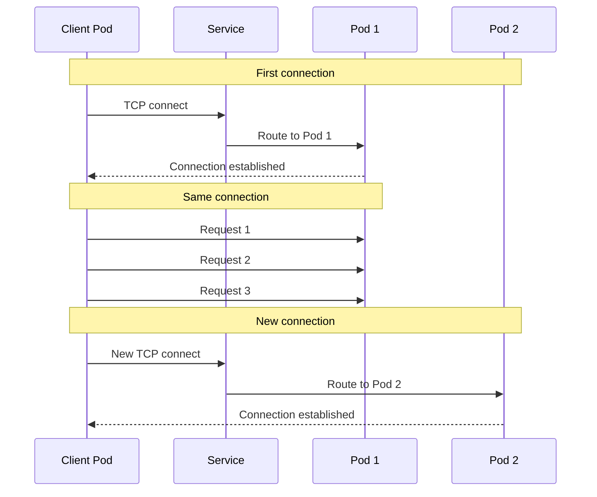
```mermaid
sequenceDiagram
    participant C as Client Pod
    participant S as Service
    participant P1 as Pod 1
    participant P2 as Pod 2

    Note over C,P2: First connection
    C->>S: TCP connect
    S->>P1: Route to Pod 1
    P1-->>C: Connection established

    Note over C,P1: Same connection
    C->>P1: Request 1
    C->>P1: Request 2
    C->>P1: Request 3

    Note over C,P2: New connection
    C->>S: New TCP connect
    S->>P2: Route to Pod 2
    P2-->>C: Connection established
```

For HTTP, enable **keep-alive** to reuse connections. Without it, each request opens a new connection and gets load balanced.

## Service Types and Traffic Flow

### ClusterIP Traffic Flow

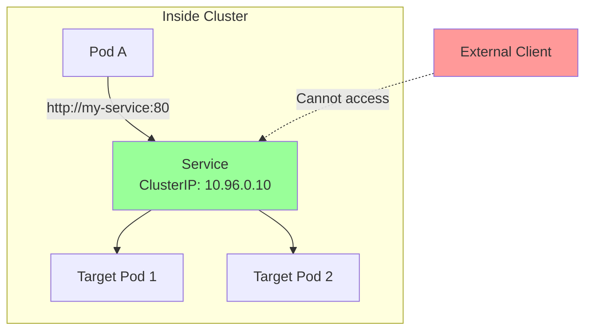
```mermaid
graph TB
    subgraph "Inside Cluster"
        Pod1[Pod A] -->|http://my-service:80| Service[Service<br/>ClusterIP: 10.96.0.10]
        Service --> Pod2[Target Pod 1]
        Service --> Pod3[Target Pod 2]
    end

    External[External Client] -.->|Cannot access| Service

    style Service fill:#99ff99
    style External fill:#ff9999
```

### NodePort Traffic Flow

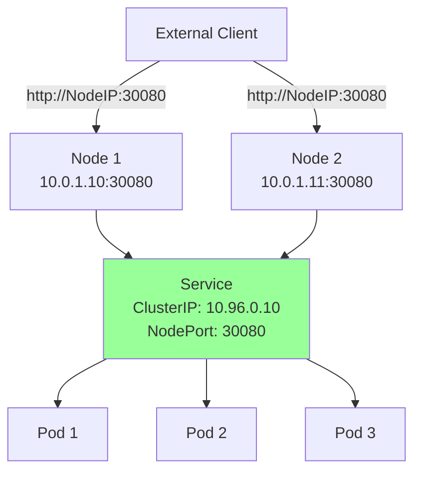
```mermaid
graph TB
    External[External Client] -->|http://NodeIP:30080| Node1[Node 1<br/>10.0.1.10:30080]
    External -->|http://NodeIP:30080| Node2[Node 2<br/>10.0.1.11:30080]

    Node1 --> Service[Service<br/>ClusterIP: 10.96.0.10<br/>NodePort: 30080]
    Node2 --> Service

    Service --> Pod1[Pod 1]
    Service --> Pod2[Pod 2]
    Service --> Pod3[Pod 3]

    style Service fill:#99ff99
```

**Key point**: You can access the Service through **any Node's IP**, even if the Pod isn't running on that node. Traffic is forwarded internally.

### LoadBalancer Traffic Flow

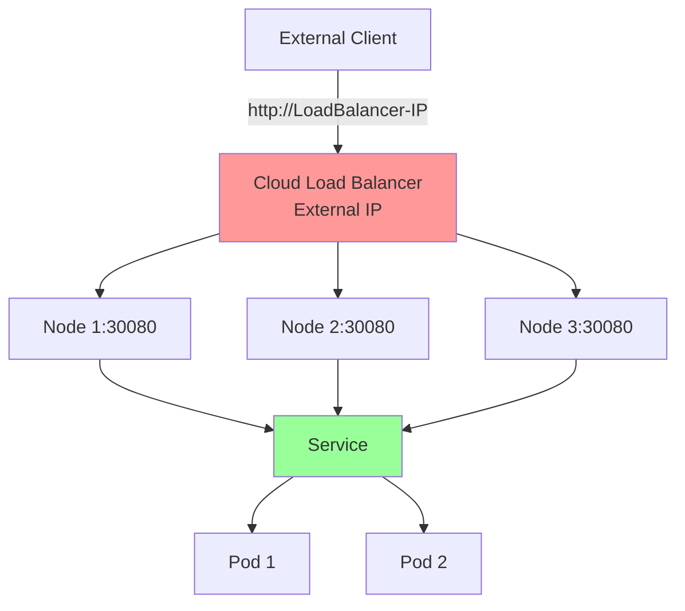
```mermaid
graph TB
    External[External Client] -->|http://LoadBalancer-IP| LB[Cloud Load Balancer<br/>External IP]

    LB --> Node1[Node 1:30080]
    LB --> Node2[Node 2:30080]
    LB --> Node3[Node 3:30080]

    Node1 --> Service[Service]
    Node2 --> Service
    Node3 --> Service

    Service --> Pod1[Pod 1]
    Service --> Pod2[Pod 2]

    style LB fill:#ff9999
    style Service fill:#99ff99
```

LoadBalancer type creates a NodePort, then configures a cloud load balancer to point to it.

## Port-Forward vs Real Traffic

### kubectl port-forward

Port-forward is a **debugging tool** that creates a direct tunnel:

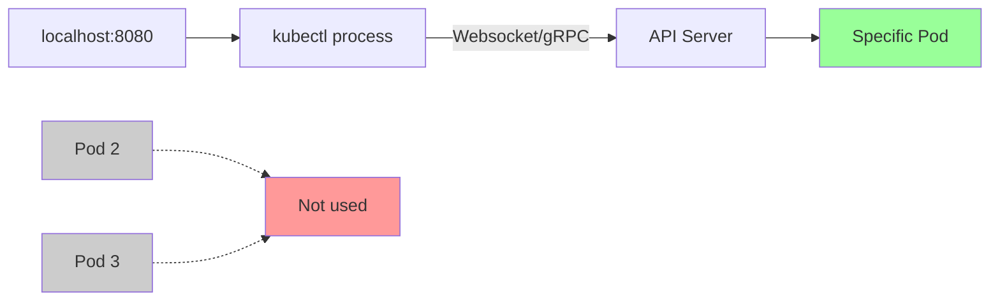
```mermaid
graph LR
    A[localhost:8080] --> B[kubectl process]
    B -->|Websocket/gRPC| C[API Server]
    C --> D[Specific Pod]

    E[Pod 2] -.-> X[Not used]
    F[Pod 3] -.-> X

    style D fill:#99ff99
    style E fill:#cccccc
    style F fill:#cccccc
    style X fill:#ff9999
```

```bash
kubectl port-forward service/my-app 8080:80
```

**What happens:**

1. kubectl opens a local port (8080)
2. Creates a tunnel through the API server
3. Forwards traffic to **one specific Pod** (selected once)
4. Other replicas are NOT used
5. Tunnel closes when kubectl exits

**Use cases:**

- Quick debugging access
- Temporary database access
- Testing without exposing service

**NOT for:**

- Load balancing testing
- Performance testing
- Production traffic

### Real Service Access

For proper load balancing testing, use:

1. **From within cluster:**

   ```bash
   kubectl run test --rm -it --image=busybox -- sh
   wget -O- http://my-service
   ```

2. **NodePort:**

   ```bash
   curl http://<node-ip>:30080
   ```

3. **Ingress** (covered in production section)

---

# Production Architecture Patterns

Production Kubernetes environments look very different from local development setups. Understanding this architecture is crucial for building reliable, scalable systems.

## Managed Kubernetes Services

Most organizations use **managed Kubernetes** services where the cloud provider operates the control plane:

- **Amazon EKS** (Elastic Kubernetes Service)
- **Google GKE** (Google Kubernetes Engine)
- **Azure AKS** (Azure Kubernetes Service)
- **DigitalOcean DOKS**
- **IBM Cloud Kubernetes Service**

### Shared Responsibility Model

```mermaid
graph TB
    subgraph "Cloud Provider Manages"
        CP[Control Plane<br/>API Server, etcd, Scheduler]
        HA[High Availability]
        Upgrades[Kubernetes Upgrades]
        Backups[etcd Backups]
    end

    subgraph "You Manage"
        Nodes[Worker Nodes]
        Apps[Applications/Workloads]
        Storage[Persistent Storage]
        Network[Network Policies]
        Security[Security & RBAC]
    end

    style CP fill:#99ff99
    style Nodes fill:#ffcc99
```

**Benefits:**

- No control plane management
- Automatic updates and patches
- Built-in high availability
- Integrated with cloud services (IAM, load balancers, storage)

## Infrastructure as Code with Terraform

Terraform is the **industry standard** for provisioning cloud infrastructure declaratively.

### Separation of Concerns

Infrastructure provisioning is **separate** from application deployment:

```mermaid
graph LR
    subgraph "Infrastructure Layer"
        TF[Terraform] -->|Creates| Infra[VPC<br/>Subnets<br/>EKS Cluster<br/>Node Groups<br/>IAM Roles]
    end

    subgraph "Application Layer"
        K8s[Kubernetes Manifests] -->|Deploys to| Apps[Deployments<br/>Services<br/>Ingress<br/>ConfigMaps]
    end

    Infra -.->|Provides platform| Apps

    style TF fill:#7B42BC
    style K8s fill:#326CE5
```

### Terraform for EKS Example

```hcl
# terraform/eks.tf
module "eks" {
  source  = "terraform-aws-modules/eks/aws"
  version = "~> 19.0"

  cluster_name    = "production-cluster"
  cluster_version = "1.27"

  vpc_id     = module.vpc.vpc_id
  subnet_ids = module.vpc.private_subnets

  # Node groups
  eks_managed_node_groups = {
    general = {
      desired_size = 3
      min_size     = 2
      max_size     = 10

      instance_types = ["t3.large"]
      capacity_type  = "ON_DEMAND"

      labels = {
        workload = "general"
      }

      taints = []
    }

    compute = {
      desired_size = 2
      min_size     = 0
      max_size     = 20

      instance_types = ["c5.2xlarge"]
      capacity_type  = "SPOT"

      labels = {
        workload = "compute-intensive"
      }
    }
  }

  # Cluster access
  cluster_endpoint_public_access = true

  tags = {
    Environment = "production"
    ManagedBy   = "terraform"
  }
}
```

### VPC and Networking

```hcl
# terraform/vpc.tf
module "vpc" {
  source = "terraform-aws-modules/vpc/aws"

  name = "production-vpc"
  cidr = "10.0.0.0/16"

  azs             = ["us-east-1a", "us-east-1b", "us-east-1c"]
  private_subnets = ["10.0.1.0/24", "10.0.2.0/24", "10.0.3.0/24"]
  public_subnets  = ["10.0.101.0/24", "10.0.102.0/24", "10.0.103.0/24"]

  enable_nat_gateway = true
  enable_dns_hostnames = true

  # Tags required for Kubernetes
  public_subnet_tags = {
    "kubernetes.io/role/elb" = "1"
  }

  private_subnet_tags = {
    "kubernetes.io/role/internal-elb" = "1"
  }
}
```

### Typical Terraform Structure

```
infrastructure/
├── terraform/
│   ├── environments/
│   │   ├── dev/
│   │   │   ├── main.tf
│   │   │   ├── variables.tf
│   │   │   └── terraform.tfvars
│   │   ├── staging/
│   │   │   └── ...
│   │   └── production/
│   │       └── ...
│   ├── modules/
│   │   ├── eks/
│   │   ├── vpc/
│   │   └── rds/
│   └── backend.tf
```

### When Terraform Runs

Terraform is used for **infrastructure changes**, not application deployments:

**Terraform runs when:**

- ✅ Creating a new cluster
- ✅ Adding/removing node groups
- ✅ Changing instance types or sizes
- ✅ Modifying network configuration
- ✅ Updating IAM roles and policies
- ✅ Provisioning databases, cache clusters

**Terraform does NOT run when:**

- ❌ Deploying new application versions
- ❌ Scaling replica counts
- ❌ Updating container images
- ❌ Changing environment variables
- ❌ Rolling out feature flags

These are handled by Kubernetes-level deployments.

## Ingress Controllers

An **Ingress** provides HTTP/HTTPS routing to services, enabling features like:

- Host-based routing (`api.example.com`, `web.example.com`)
- Path-based routing (`example.com/api`, `example.com/blog`)
- TLS/SSL termination
- Load balancing

### Ingress Architecture

```mermaid
graph TB
    Internet([Internet])

    Internet -->|HTTPS| LB[Cloud Load Balancer<br/>AWS ALB/NLB]

    LB --> IC[Ingress Controller Pod<br/>nginx/traefik/istio]

    IC -->|Host: api.example.com| S1[API Service]
    IC -->|Host: web.example.com| S2[Web Service]
    IC -->|Path: /blog| S3[Blog Service]

    S1 --> P1[API Pods]
    S2 --> P2[Web Pods]
    S3 --> P3[Blog Pods]

    style IC fill:#ff9999
    style LB fill:#ffcc99
```

### Ingress Resource Example

```yaml
apiVersion: networking.k8s.io/v1
kind: Ingress
metadata:
  name: app-ingress
  annotations:
    cert-manager.io/cluster-issuer: "letsencrypt-prod"
    nginx.ingress.kubernetes.io/ssl-redirect: "true"
spec:
  ingressClassName: nginx
  tls:
    - hosts:
        - api.example.com
        - web.example.com
      secretName: tls-certificate
  rules:
    - host: api.example.com
      http:
        paths:
          - path: /
            pathType: Prefix
            backend:
              service:
                name: api-service
                port:
                  number: 80
    - host: web.example.com
      http:
        paths:
          - path: /
            pathType: Prefix
            backend:
              service:
                name: web-service
                port:
                  number: 80
          - path: /blog
            pathType: Prefix
            backend:
              service:
                name: blog-service
                port:
                  number: 80
```

### Popular Ingress Controllers

| Controller      | Best For         | Features                                   |
| --------------- | ---------------- | ------------------------------------------ |
| **NGINX**       | General purpose  | Most popular, stable, fast                 |
| **Traefik**     | Dynamic routing  | Auto service discovery, simple config      |
| **HAProxy**     | High performance | Enterprise features, very fast             |
| **AWS ALB**     | AWS-native       | Integrated ALB, native AWS features        |
| **Istio/Envoy** | Service mesh     | Advanced traffic management, observability |

## Production Architecture Example

```mermaid
graph TB
    Users[End Users]

    subgraph "AWS Cloud"
        Route53[Route53 DNS<br/>example.com]

        subgraph "Load Balancing"
            ALB[Application Load Balancer<br/>TLS Termination]
        end

        subgraph "EKS Cluster"
            subgraph "Ingress"
                IC[NGINX Ingress Controller]
            end

            subgraph "Application Tier"
                FE[Frontend Deployment<br/>3 replicas]
                API[API Deployment<br/>5 replicas]
                Worker[Background Workers<br/>2 replicas]
            end

            subgraph "Data Tier"
                Redis[Redis Cache<br/>StatefulSet]
            end
        end

        subgraph "Managed Services"
            RDS[(RDS PostgreSQL<br/>Multi-AZ)]
            S3[S3 Buckets]
        end
    end

    Users --> Route53
    Route53 --> ALB
    ALB --> IC
    IC --> FE
    IC --> API
    API --> Redis
    API --> RDS
    API --> S3
    Worker --> RDS
    Worker --> S3

    style Users fill:#99ccff
    style EKS fill:#fff4e1
    style RDS fill:#ff9999
```

## Multi-Environment Strategy

### Environment Isolation Approaches

#### 1. Separate Clusters (Recommended)

```mermaid
graph TB
    subgraph "Development Cluster"
        DevApps[All Dev Applications]
    end

    subgraph "Staging Cluster"
        StagingApps[Staging Applications]
    end

    subgraph "Production Cluster"
        ProdApps[Production Applications]
    end

    style Development fill:#e1f5ff
    style Staging fill:#fff4e1
    style Production fill:#ffe1e1
```

**Pros:**

- Complete isolation (blast radius limited)
- Different cluster configurations per environment
- Independent upgrades and testing
- Better security boundaries

**Cons:**

- Higher cost (multiple control planes)
- More complexity to manage
- Resource overhead

#### 2. Namespace Isolation (Same Cluster)

```mermaid
graph TB
    subgraph "Shared Cluster"
        subgraph "Namespace: dev"
            DevApps[Dev Apps]
        end

        subgraph "Namespace: staging"
            StagingApps[Staging Apps]
        end

        subgraph "Namespace: prod"
            ProdApps[Prod Apps]
        end
    end

    style dev fill:#e1f5ff
    style staging fill:#fff4e1
    style prod fill:#ffe1e1
```

**Pros:**

- Lower cost (shared control plane)
- Easier management
- Better resource utilization

**Cons:**

- Security risks (namespace isolation not perfect)
- Resource contention possible
- Cluster issues affect all environments

**Best practice**: Separate clusters for production, namespace isolation acceptable for dev/staging.

---

# CI/CD and GitOps

Modern Kubernetes deployments use automated pipelines to deliver applications. The evolution from traditional CI/CD to GitOps represents a maturity progression.

## Traditional CI/CD Pipeline

```mermaid
graph LR
    A[Developer] -->|git push| B[Git Repository]
    B -->|Webhook| C[CI System<br/>Build & Test]
    C -->|Push| D[Container Registry]
    C -->|kubectl apply| E[Kubernetes Cluster]

    style C fill:#99ccff
    style E fill:#99ff99
```

### Typical Flow

1. **Developer pushes code** to Git (GitHub, GitLab, Bitbucket)
2. **CI pipeline triggers** (GitHub Actions, Jenkins, GitLab CI)
3. **Build steps:**

   ```bash
   # Run tests
   npm test

   # Build Docker image
   docker build -t myapp:${GIT_SHA} .

   # Push to registry
   docker push myregistry/myapp:${GIT_SHA}
   ```

4. **Deployment step:**

   ```bash
   # Update Kubernetes
   kubectl set image deployment/myapp app=myapp:${GIT_SHA}

   # Or with Helm
   helm upgrade myapp ./chart --set image.tag=${GIT_SHA}
   ```

### Problems with Direct Deployment

❌ **Security**: CI system needs cluster credentials  
❌ **Auditability**: No clear record of what's deployed  
❌ **Drift**: Cluster state can diverge from Git  
❌ **No rollback**: Hard to revert to previous state  
❌ **No sync**: Manual changes aren't detected

## GitOps Model (Recommended)

GitOps treats **Git as the single source of truth** for infrastructure and applications.

### Core Principles

1. **Declarative**: System state defined declaratively (YAML manifests)
2. **Versioned**: All changes committed to Git
3. **Automated**: Software agents ensure cluster matches Git
4. **Continuously reconciled**: Cluster state continuously synced

### GitOps Architecture

```mermaid
graph TB
    Dev[Developer]

    subgraph "Git Repositories"
        AppRepo[Application Code<br/>github.com/org/app]
        ConfigRepo[Config Repository<br/>github.com/org/k8s-manifests]
    end

    subgraph "CI System"
        Build[Build & Test]
        Registry[Container Registry]
    end

    subgraph "GitOps Operator"
        ArgoCD[ArgoCD / Flux]
    end

    subgraph "Kubernetes Cluster"
        Deploy[Deployments]
        Pods[Running Pods]
    end

    Dev -->|1. Push code| AppRepo
    AppRepo -->|2. Trigger| Build
    Build -->|3. Build image| Registry
    Build -->|4. Update manifest| ConfigRepo

    ConfigRepo <-->|5. Watch & Sync| ArgoCD
    ArgoCD -->|6. Apply| Deploy
    Deploy --> Pods

    style ConfigRepo fill:#99ff99
    style ArgoCD fill:#ff9999
```

### Detailed GitOps Flow

#### Step 1: Application Code Change

```bash
# Developer workflow
git clone github.com/org/myapp
cd myapp
# Make code changes
git commit -m "Add new feature"
git push
```

#### Step 2: CI Builds Image

```yaml
# .github/workflows/ci.yml
name: CI
on: push

jobs:
  build:
    runs-on: ubuntu-latest
    steps:
      - uses: actions/checkout@v3

      - name: Build image
        run: |
          docker build -t myregistry/myapp:${{ github.sha }} .
          docker push myregistry/myapp:${{ github.sha }}

      - name: Update manifest repo
        run: |
          git clone github.com/org/k8s-manifests
          cd k8s-manifests

          # Update image tag in values file
          yq eval '.image.tag = "${{ github.sha }}"' -i apps/myapp/values.yaml

          git commit -am "Update myapp to ${{ github.sha }}"
          git push
```

#### Step 3: Config Repository Structure

```
k8s-manifests/
├── apps/
│   ├── myapp/
│   │   ├── deployment.yaml
│   │   ├── service.yaml
│   │   ├── ingress.yaml
│   │   └── values.yaml
│   └── other-app/
│       └── ...
├── infrastructure/
│   ├── ingress-nginx/
│   ├── cert-manager/
│   └── monitoring/
└── environments/
    ├── staging/
    │   └── kustomization.yaml
    └── production/
        └── kustomization.yaml
```

#### Step 4: GitOps Tool Syncs

ArgoCD or Flux watches the config repository:

```yaml
# argocd-application.yaml
apiVersion: argoproj.io/v1alpha1
kind: Application
metadata:
  name: myapp
  namespace: argocd
spec:
  project: default

  source:
    repoURL: https://github.com/org/k8s-manifests
    targetRevision: HEAD
    path: apps/myapp

  destination:
    server: https://kubernetes.default.svc
    namespace: production

  syncPolicy:
    automated:
      prune: true # Delete resources not in Git
      selfHeal: true # Revert manual changes
    syncOptions:
      - CreateNamespace=true
```

When Git changes, ArgoCD:

1. Detects the change (webhook or polling)
2. Compares desired state (Git) vs current state (cluster)
3. Applies necessary changes to cluster
4. Reports sync status

### Benefits of GitOps

✅ **Version Control**: Every change tracked in Git  
✅ **Audit Trail**: Complete history of who changed what  
✅ **Easy Rollback**: `git revert` to undo changes  
✅ **Security**: Cluster credentials not in CI  
✅ **Drift Detection**: Manual changes automatically reverted  
✅ **Multi-cluster**: Same pattern for all environments

### GitOps Tools Comparison

#### ArgoCD

```mermaid
graph LR
    A[Git Repo] <-->|Pull| B[ArgoCD Server]
    B --> C[Application Controller]
    C -->|Apply| D[Kubernetes API]
    B --> E[Web UI]

    style B fill:#ff9999
```

**Features:**

- Excellent Web UI
- Multi-cluster management
- SSO integration
- Health assessment
- Automated sync and rollback
- Helm, Kustomize, plain YAML support

#### Flux CD

```mermaid
graph LR
    A[Git Repo] <-->|Pull| B[Source Controller]
    B --> C[Kustomize Controller]
    B --> D[Helm Controller]
    C -->|Apply| E[Kubernetes API]
    D -->|Apply| E

    style B fill:#ff9999
```

**Features:**

- GitOps Toolkit (modular components)
- Native Kubernetes CRDs
- Notification system
- Image update automation
- Helm support
- Multi-tenancy

## Deployment Strategies

### Rolling Update (Default)

```mermaid
sequenceDiagram
    participant Old as Old Pods (v1)
    participant New as New Pods (v2)
    participant Traffic as Traffic

    Note over Old: 3 pods running
    Note over New: Create 1 new pod
    New->>Traffic: Ready
    Note over Old: Terminate 1 old pod
    Note over Old: 2 old, 1 new
    Note over New: Create 1 new pod
    New->>Traffic: Ready
    Note over Old: Terminate 1 old pod
    Note over Old: 1 old, 2 new
    Note over New: Create 1 new pod
    New->>Traffic: Ready
    Note over Old: Terminate last old pod
    Note over New: 3 new pods running
```

```yaml
spec:
  strategy:
    type: RollingUpdate
    rollingUpdate:
      maxUnavailable: 1
      maxSurge: 1
```

### Blue-Green Deployment

Two complete environments, instant switch:

```mermaid
graph TB
    Service[Service]

    subgraph "Blue (v1) - Active"
        B1[Pod v1]
        B2[Pod v1]
        B3[Pod v1]
    end

    subgraph "Green (v2) - Standby"
        G1[Pod v2]
        G2[Pod v2]
        G3[Pod v2]
    end

    Service -.->|Switch selector| Green
    Service -->|Current| Blue

    style Blue fill:#99ccff
    style Green fill:#99ff99
```

### Canary Deployment

Gradual traffic shift:

```yaml
# Canary - 10% traffic
apiVersion: v1
kind: Service
metadata:
  name: myapp-canary
spec:
  selector:
    app: myapp
    version: v2
  ports:
    - port: 80

---
# Stable - 90% traffic
apiVersion: v1
kind: Service
metadata:
  name: myapp-stable
spec:
  selector:
    app: myapp
    version: v1
  ports:
    - port: 80
```

Use service mesh (Istio, Linkerd) or Argo Rollouts for advanced canary:

```yaml
apiVersion: argoproj.io/v1alpha1
kind: Rollout
spec:
  strategy:
    canary:
      steps:
        - setWeight: 10 # 10% to canary
        - pause: { duration: 5m }
        - setWeight: 25
        - pause: { duration: 5m }
        - setWeight: 50
        - pause: { duration: 5m }
        - setWeight: 100 # Full rollout
```

---

# Organizational Models

How teams structure their relationship with Kubernetes has evolved significantly. Understanding these models helps you recognize where your organization fits and where it might be heading.

## Traditional Ops Model

The classic "throw it over the wall" approach:

```mermaid
graph LR
    subgraph "Development Team"
        Dev[Developers]
    end

    subgraph "Wall"
        W[ ]
        style W fill:#ff0000
    end

    subgraph "Operations Team"
        Ops[Ops Engineers]
        K8s[Kubernetes Cluster]
    end

    Dev -->|Hands off code| W
    W -->|Tickets/Requests| Ops
    Ops --> K8s

    style Dev fill:#99ccff
    style Ops fill:#ffcc99
```

### Characteristics

- **Clear separation**: Dev writes code, Ops deploys it
- **Ticket-based**: Deployments require ops tickets
- **No cluster access** for developers
- **Ops bottleneck**: All changes go through ops team
- **Slow feedback**: Long cycle time for fixes

### Problems

❌ Slow deployment cycles (days/weeks)  
❌ Knowledge silos (devs don't understand prod)  
❌ Blame culture ("works on my machine")  
❌ Ops overwhelmed with deployment requests  
❌ Difficult to debug production issues

### When It Makes Sense

- Highly regulated industries (initially)
- Legacy organizations transitioning to cloud
- Limited Kubernetes expertise

## DevOps Model

"You build it, you run it" philosophy:

```mermaid
graph TB
    subgraph "DevOps Team"
        Dev[Developers]

        subgraph "Responsibilities"
            Code[Write Code]
            Deploy[Deploy Apps]
            Monitor[Monitor Systems]
            Incident[Respond to Incidents]
        end

        K8s[Kubernetes Cluster]
    end

    Dev --> Code
    Dev --> Deploy
    Dev --> Monitor
    Dev --> Incident

    Deploy --> K8s
    Monitor --> K8s
    Incident --> K8s

    style Dev fill:#99ff99
    style K8s fill:#ffcc99
```

### Characteristics

- **Full ownership**: Teams own entire lifecycle
- **Direct cluster access**: Developers can deploy
- **Faster iterations**: No ops bottleneck
- **Better accountability**: Team responsible for uptime
- **Shared on-call**: Developers participate in incident response

### Implementation

```mermaid
graph LR
    subgraph "Team: Checkout Service"
        T1Dev[Developers]
        T1Pipeline[CI/CD Pipeline]
        T1Namespace[Namespace: checkout]
        T1Monitor[Team Monitors/Alerts]
    end

    subgraph "Team: Inventory Service"
        T2Dev[Developers]
        T2Pipeline[CI/CD Pipeline]
        T2Namespace[Namespace: inventory]
        T2Monitor[Team Monitors/Alerts]
    end

    T1Dev --> T1Pipeline
    T1Pipeline --> T1Namespace
    T1Namespace --> T1Monitor

    T2Dev --> T2Pipeline
    T2Pipeline --> T2Namespace
    T2Namespace --> T2Monitor

    style T1Namespace fill:#e1f5ff
    style T2Namespace fill:#ffe1e1
```

Each team:

- Has its own namespace(s)
- Manages its own CI/CD
- Sets up its own monitoring
- Responds to its own incidents

### Benefits

✅ Fast deployment velocity  
✅ Developers understand production  
✅ Better quality (teams feel pain of issues)  
✅ Innovation encouraged  
✅ Ownership culture

### Challenges

❌ Each team reinvents the wheel  
❌ Inconsistent practices across teams  
❌ Security and compliance harder to enforce  
❌ Infrastructure knowledge required per team  
❌ Can lead to cluster sprawl

## Platform Engineering + GitOps (Modern)

The most mature model—central platform team provides self-service infrastructure:

```mermaid
graph TB
    subgraph "Platform Team"
        PE[Platform Engineers]

        subgraph "Platform Provides"
            Cluster[Kubernetes Clusters]
            Tools[CI/CD Tools]
            Observability[Monitoring/Logging]
            Security[Security Policies]
            Templates[App Templates]
        end
    end

    subgraph "Application Team 1"
        App1Dev[Developers]
        App1Manifests[Git: K8s Manifests]
    end

    subgraph "Application Team 2"
        App2Dev[Developers]
        App2Manifests[Git: K8s Manifests]
    end

    subgraph "GitOps Engine"
        ArgoCD[ArgoCD/Flux]
    end

    PE --> Cluster
    PE --> Tools
    PE --> Observability
    PE --> Security
    PE --> Templates

    App1Dev -->|Commit| App1Manifests
    App2Dev -->|Commit| App2Manifests

    App1Manifests -->|Watches| ArgoCD
    App2Manifests -->|Watches| ArgoCD

    ArgoCD -->|Deploys to| Cluster

    style PE fill:#ff9999
    style ArgoCD fill:#99ff99
    style Cluster fill:#ffcc99
```

### Responsibilities Split

#### Platform Team

**Owns:**

- Cluster provisioning and upgrades
- Base infrastructure (networking, storage, ingress)
- Security policies and RBAC
- Monitoring and logging infrastructure
- CI/CD tooling (ArgoCD, Flux)
- Golden path templates
- Platform documentation

**Provides:**

- Self-service developer portal
- Standardized deployment patterns
- Compliance guardrails
- Performance optimization
- Cost management

#### Application Teams

**Owns:**

- Application code
- Kubernetes manifests (Deployment, Service, etc.)
- Application-specific configuration
- Application monitoring dashboards
- Application documentation

**Uses:**

- Platform-provided CI/CD
- Platform monitoring tools
- Pre-configured security policies
- Standardized templates

### How It Works

#### 1. Platform Team Creates Foundation

```
platform-infrastructure/
├── clusters/
│   ├── dev-cluster/
│   ├── staging-cluster/
│   └── prod-cluster/
├── base-services/
│   ├── ingress-nginx/
│   ├── cert-manager/
│   ├── prometheus/
│   └── loki/
└── policies/
    ├── network-policies/
    ├── pod-security-standards/
    └── resource-quotas/
```

#### 2. Application Teams Use Templates

```bash
# Platform provides scaffold tool
platform-cli create-app my-new-service --template=web-api

# Generates structure:
my-new-service/
├── src/
├── Dockerfile
└── k8s/
    ├── deployment.yaml
    ├── service.yaml
    ├── ingress.yaml
    └── values/
        ├── dev.yaml
        ├── staging.yaml
        └── prod.yaml
```

#### 3. GitOps Automates Deployment

```yaml
# apps/my-service/deployment.yaml (in Git)
apiVersion: apps/v1
kind: Deployment
metadata:
  name: my-service
  annotations:
    platform.company.com/team: "checkout"
    platform.company.com/oncall: "checkout-team@company.com"
spec:
  replicas: 3
  template:
    spec:
      # Platform enforces security policies automatically
      securityContext:
        runAsNonRoot: true
      containers:
        - name: app
          image: myregistry/my-service:v1.2.3
          resources:
            # Platform sets limits via LimitRange
            requests:
              cpu: 100m
              memory: 128Mi
            limits:
              cpu: 500m
              memory: 512Mi
```

Developers just commit to Git—ArgoCD deploys automatically.

#### 4. Platform Enforces Policies

```yaml
# Policy: All ingresses must use TLS
apiVersion: kyverno.io/v1
kind: ClusterPolicy
metadata:
  name: require-ingress-tls
spec:
  rules:
    - name: check-tls
      match:
        resources:
          kinds:
            - Ingress
      validate:
        message: "All Ingresses must have TLS configured"
        pattern:
          spec:
            tls:
              - hosts:
                  - "?*"
```

### Benefits of Platform Model

✅ **Consistency**: Standardized patterns across teams  
✅ **Compliance**: Policies enforced automatically  
✅ **Efficiency**: Teams don't reinvent the wheel  
✅ **Scale**: Platform team scales 1:many with app teams  
✅ **Innovation**: App teams focus on business logic  
✅ **Security**: Centralized security management  
✅ **Cost optimization**: Platform team optimizes cluster usage

### Platform Maturity Levels

```mermaid
graph LR
    L1[Level 1:<br/>Basic Cluster] --> L2[Level 2:<br/>Self-Service Tools]
    L2 --> L3[Level 3:<br/>Golden Paths]
    L3 --> L4[Level 4:<br/>Full Platform]

    style L1 fill:#ffcccc
    style L2 fill:#ffffcc
    style L3 fill:#ccffcc
    style L4 fill:#ccffff
```

**Level 1: Basic Cluster**

- Kubernetes cluster exists
- Teams manually kubectl apply
- Minimal standardization

**Level 2: Self-Service Tools**

- CI/CD pipelines available
- Basic monitoring/logging
- Teams still need K8s knowledge

**Level 3: Golden Paths**

- Standardized templates
- GitOps enabled
- Policy enforcement
- Developer portal

**Level 4: Full Platform**

- Complete abstraction from K8s
- Auto-scaling, auto-healing
- Cost attribution per team
- Developer-friendly API
- Multi-cluster management

### Real-World Examples

**Spotify's Backstage:**

- Developer portal (open source)
- Service catalog
- Template scaffolding
- Documentation integration

**Humanitec's Platform Orchestrator:**

- Abstract away infrastructure
- Score specification for workloads
- Multi-environment management

**Internal Developer Platforms (IDP):**
Many companies build custom platforms combining:

- ArgoCD/Flux (GitOps)
- Crossplane (infrastructure as code)
- Backstage (developer portal)
- Kyverno/OPA (policy enforcement)

## Choosing Your Model

```mermaid
graph TD
    Start{Organization Size}

    Start -->|Small<br/>< 10 devs| DevOps[DevOps Model<br/>Simple, Fast]

    Start -->|Medium<br/>10-100 devs| Eval{Kubernetes<br/>Expertise?}

    Eval -->|High| Platform1[Early Platform<br/>Level 2-3]
    Eval -->|Low| DevOps2[DevOps + Training]

    Start -->|Large<br/>> 100 devs| Platform2[Full Platform<br/>Level 3-4]

    DevOps2 -->|Mature| Platform1
    Platform1 -->|Scale| Platform2

    style DevOps fill:#99ccff
    style DevOps2 fill:#99ccff
    style Platform1 fill:#99ff99
    style Platform2 fill:#99ff99
```

### Decision Factors

| Factor           | DevOps      | Platform Engineering |
| ---------------- | ----------- | -------------------- |
| Team size        | < 50        | > 50                 |
| K8s maturity     | Growing     | Established          |
| Compliance needs | Low         | High                 |
| Standardization  | Flexible    | Required             |
| Platform team    | None needed | 2-5+ engineers       |
| Time to value    | Faster      | Initial investment   |

---

# Mental Models and Best Practices

Understanding these concepts helps you think correctly about Kubernetes.

## The Reconciliation Loop

Kubernetes constantly works to match reality with your desired state:

```mermaid
graph LR
    A[Observe<br/>Current State] --> B[Compare]
    B --> C{Match?}
    C -->|Yes| D[Do Nothing]
    C -->|No| E[Take Action]
    E --> A
    D --> A

    style C fill:#ffcc99
```

**Key insight**: You don't tell Kubernetes _how_ to do things—you declare _what_ you want.

❌ Wrong: "Start 3 containers, distribute them across nodes, monitor them..."  
✅ Right: "I want 3 replicas of this Pod running"

## Immutable Infrastructure

Containers and Pods are immutable—you don't update them, you replace them:

```mermaid
graph LR
    Old[Old Pod<br/>v1.0] -->|Don't modify| X[❌]
    New[New Pod<br/>v1.1] -->|Create new| Check[✅]

    style Old fill:#ffcccc
    style New fill:#ccffcc
```

**Benefits:**

- Predictable deployments
- Easy rollbacks
- No configuration drift
- Simplified debugging

## Labels and Selectors

Labels are the "glue" connecting Kubernetes objects:

```yaml
# Deployment creates Pods with labels
apiVersion: apps/v1
kind: Deployment
metadata:
  name: web
spec:
  template:
    metadata:
      labels:
        app: web
        tier: frontend
        version: v2
    spec:
      containers:
        - name: nginx
          image: nginx

---
# Service selects Pods by label
apiVersion: v1
kind: Service
metadata:
  name: web-service
spec:
  selector:
    app: web # Targets Pods with app=web
    tier: frontend
  ports:
    - port: 80
```

```mermaid
graph TB
    Service[Service<br/>selector: app=web]

    Service -.->|Selects| P1[Pod<br/>app=web<br/>tier=frontend]
    Service -.->|Selects| P2[Pod<br/>app=web<br/>tier=frontend]
    Service -.->|Ignores| P3[Pod<br/>app=api<br/>tier=backend]

    style Service fill:#99ff99
    style P1 fill:#99ccff
    style P2 fill:#99ccff
    style P3 fill:#cccccc
```

**Best practices:**

- Use consistent label conventions
- Include app, component, version labels
- Use labels for organization (team, cost-center)

## Resource Requests vs Limits

Understanding the difference is crucial for cluster stability:

```yaml
resources:
  requests: # Minimum guaranteed
    cpu: 100m
    memory: 128Mi
  limits: # Maximum allowed
    cpu: 500m
    memory: 512Mi
```

### How Scheduling Works

```mermaid
graph TD
    Pod[New Pod<br/>requests: 2 CPU]
    Sched[Scheduler]

    N1[Node 1<br/>Available: 1 CPU]
    N2[Node 2<br/>Available: 3 CPU]
    N3[Node 3<br/>Available: 5 CPU]

    Pod --> Sched
    Sched -.->|Won't fit| N1
    Sched -->|Can fit| N2
    Sched -->|Can fit| N3
    Sched -->|Chooses best| N2

    style N1 fill:#ffcccc
    style N2 fill:#ccffcc
    style N3 fill:#ccffcc
```

**Requests**: Used for scheduling decisions  
**Limits**: Enforced at runtime (Pod killed if exceeded)

### Quality of Service Classes

Based on requests/limits configuration:

| QoS Class      | Configuration      | Priority | Eviction Order |
| -------------- | ------------------ | -------- | -------------- |
| **Guaranteed** | requests = limits  | Highest  | Last           |
| **Burstable**  | requests < limits  | Medium   | Second         |
| **BestEffort** | No requests/limits | Lowest   | First          |

## Probes for Health Checking

Kubernetes uses probes to determine Pod health:

### Liveness Probe

"Is the container alive?"

```yaml
livenessProbe:
  httpGet:
    path: /healthz
    port: 8080
  initialDelaySeconds: 15
  periodSeconds: 10
```

**Failed liveness** → Kubernetes restarts the container

### Readiness Probe

"Is the container ready to serve traffic?"

```yaml
readinessProbe:
  httpGet:
    path: /ready
    port: 8080
  initialDelaySeconds: 5
  periodSeconds: 5
```

**Failed readiness** → Pod removed from Service endpoints (no traffic sent)

### Startup Probe

"Has the container finished starting?" (for slow-starting apps)

```yaml
startupProbe:
  httpGet:
    path: /startup
    port: 8080
  failureThreshold: 30
  periodSeconds: 10
```

### Probe Strategy

```mermaid
sequenceDiagram
    participant K8s
    participant Container

    Note over Container: Starting...
    K8s->>Container: Startup probe
    Container-->>K8s: Success

    Note over Container: Running
    K8s->>Container: Readiness probe
    Container-->>K8s: Success
    Note over K8s: Add to Service

    K8s->>Container: Liveness probe
    Container-->>K8s: Success

    Note over Container: Processing slow request
    K8s->>Container: Readiness probe
    Container-->>K8s: Failure (overloaded)
    Note over K8s: Remove from Service

    Note over Container: Request complete
    K8s->>Container: Readiness probe
    Container-->>K8s: Success
    Note over K8s: Add back to Service
```

## Networking Best Practices

### Use Services for Discovery

❌ Don't hardcode Pod IPs  
✅ Use Service DNS names

```bash
# Wrong
http://10.244.1.5:8080/api

# Right
http://backend-service:8080/api
http://backend-service.production.svc.cluster.local:8080/api
```

### Test Load Balancing Properly

As covered earlier:

❌ **Don't use** `kubectl port-forward` to test load balancing  
✅ **Do use** real Service access (NodePort, Ingress, or in-cluster requests)

### Network Policies for Security

Implement least-privilege networking:

```yaml
apiVersion: networking.k8s.io/v1
kind: NetworkPolicy
metadata:
  name: api-policy
spec:
  podSelector:
    matchLabels:
      app: api
  policyTypes:
    - Ingress
    - Egress
  ingress:
    - from:
        - podSelector:
            matchLabels:
              app: frontend
      ports:
        - protocol: TCP
          port: 8080
  egress:
    - to:
        - podSelector:
            matchLabels:
              app: database
      ports:
        - protocol: TCP
          port: 5432
```

## Configuration Management

### ConfigMaps vs Secrets

| Aspect                 | ConfigMap                 | Secret                     |
| ---------------------- | ------------------------- | -------------------------- |
| **Purpose**            | Non-sensitive config      | Sensitive data             |
| **Encoding**           | Plain text                | Base64                     |
| **At-rest encryption** | No                        | Optional (enable!)         |
| **Size limit**         | 1MB                       | 1MB                        |
| **Use case**           | App config, feature flags | Passwords, API keys, certs |

### External Secrets

For production, use external secret management:

```yaml
# ExternalSecret (from External Secrets Operator)
apiVersion: external-secrets.io/v1beta1
kind: ExternalSecret
metadata:
  name: database-credentials
spec:
  secretStoreRef:
    name: aws-secrets-manager
    kind: SecretStore
  target:
    name: db-secret
  data:
    - secretKey: password
      remoteRef:
        key: prod/database/password
```

Integrates with:

- AWS Secrets Manager
- Azure Key Vault
- Google Secret Manager
- HashiCorp Vault

## Observability

The three pillars:

### 1. Metrics (Prometheus)

```yaml
apiVersion: v1
kind: Service
metadata:
  name: my-app
  annotations:
    prometheus.io/scrape: "true"
    prometheus.io/port: "8080"
    prometheus.io/path: "/metrics"
```

### 2. Logs (Loki, ELK)

```yaml
spec:
  containers:
    - name: app
      image: myapp
      # Log to stdout/stderr
      # Collected automatically by cluster logging
```

### 3. Traces (Jaeger, Tempo)

Distributed tracing for request flows across services.

## Key Takeaways

### Minikube/kind vs Production

- **Local tools** simulate Kubernetes but differ in networking, storage, and scale
- Always test in environment resembling production

### kubectl port-forward

- **Debugging tool only**
- Connects to single Pod
- Does not demonstrate load balancing
- Use Services/Ingress for real traffic

### Infrastructure vs Application

- **Terraform/IaC**: Manages infrastructure (clusters, networks, databases)
- **Kubernetes manifests**: Manages applications (Deployments, Services)
- **GitOps**: Automates application deployment
- Terraform runs rarely; GitOps runs constantly

### Services Provide Stability

- Pod IPs change constantly
- Services provide stable endpoints
- Enables zero-downtime deployments
- Use DNS names, not IPs

### Declarative > Imperative

- Declare desired state in YAML
- Kubernetes reconciles continuously
- Version control your manifests
- Git becomes source of truth

### Platform Thinking

- Mature organizations build internal platforms
- Platform team provides self-service infrastructure
- Application teams focus on business logic
- GitOps enables scale and consistency

---

## Next Steps

To deepen your Kubernetes knowledge:

1. **Practice with Minikube/kind**
   - Deploy a multi-tier application
   - Experiment with Services, Ingress
   - Try rolling updates and rollbacks

2. **Learn YAML deeply**
   - Understand all Deployment options
   - Master ConfigMaps and Secrets
   - Explore Pod specs thoroughly

3. **Study Networking**
   - Understand CNI plugins
   - Practice with Network Policies
   - Learn Ingress controllers

4. **Explore GitOps**
   - Set up ArgoCD or Flux
   - Create a manifest repository
   - Implement automated deployments

5. **Understand Security**
   - RBAC (Role-Based Access Control)
   - Pod Security Standards
   - Secret management solutions

6. **Monitoring and Logging**
   - Prometheus + Grafana
   - ELK or Loki stack
   - Distributed tracing

7. **Advanced Topics**
   - Helm charts
   - Kustomize
   - Operators and CRDs
   - Service meshes (Istio, Linkerd)

---

## Resources

- [Official Kubernetes Documentation](https://kubernetes.io/docs/)
- [Kubernetes the Hard Way](https://github.com/kelseyhightower/kubernetes-the-hard-way)
- [ArgoCD Documentation](https://argo-cd.readthedocs.io/)
- [Flux Documentation](https://fluxcd.io/docs/)
- [CNCF Landscape](https://landscape.cncf.io/)

---

_End of Kubernetes Learning Notes_
